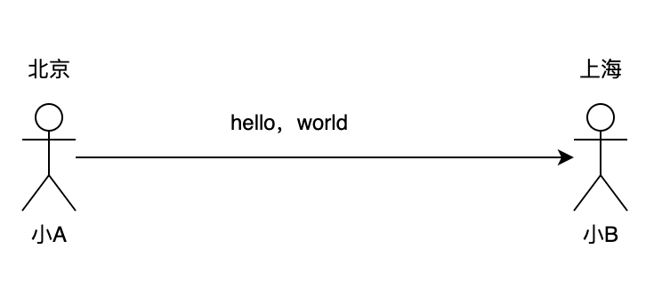
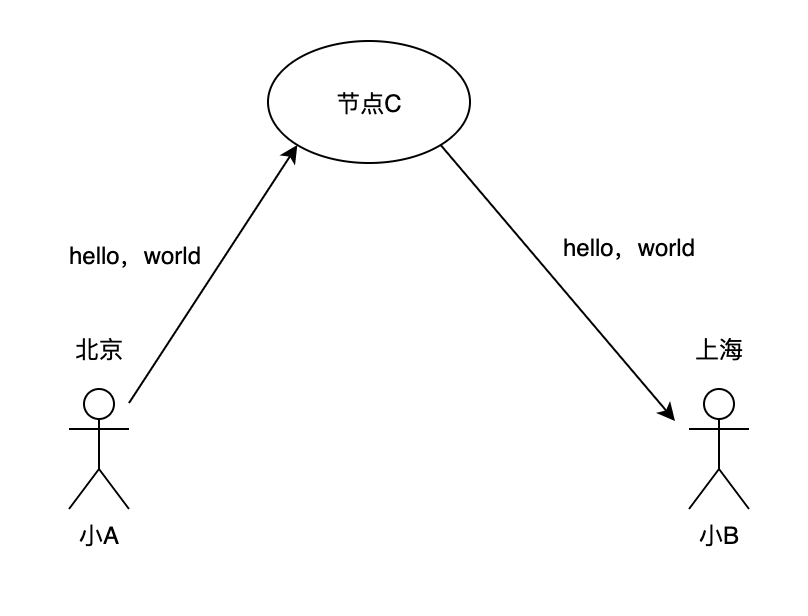
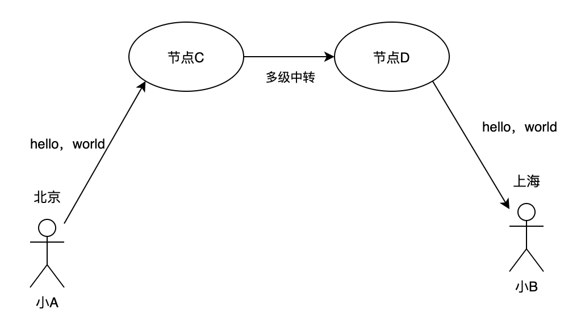
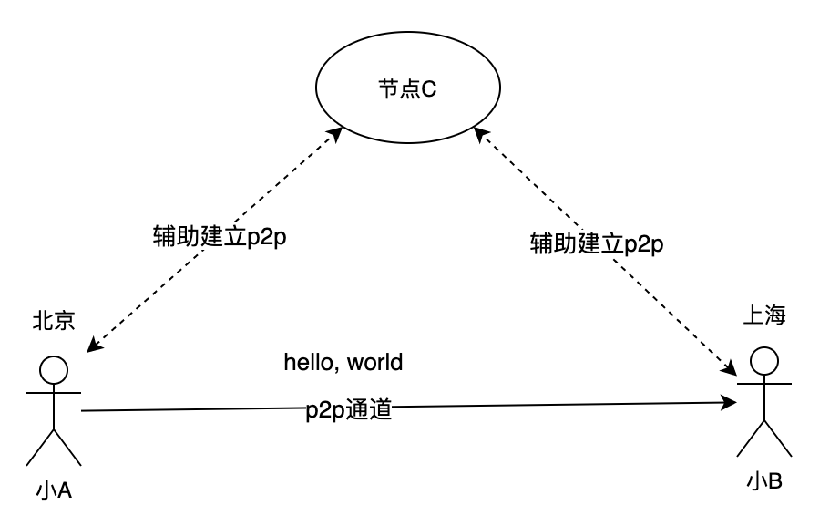

# 1. 最简单的实时消息系统

不知道大家有没有想过这个问题，身在北京的小A使用微信给在上海的小B发送了一句`hello，world`，那么从小A按下发送键那一刻到小B读到这条消息，微信的都做了哪些事情？

很显然，我不是微信的工程师，并不清楚其中的细节（手动狗头，微信的大佬要不要把我收了？✨），但是我们可以从这个角度说一下一个最简单的实时消息系统的实现原理。

- 北京的用户A如何将请求发送给上海的用户B

  事实上在这个简单场景里，我们需要解决两个隐含的问题：

1. A如何找到B
2. A如何把消息传给B

## A如何找到B

我们都知道在网络传输中需要知道源地址和目的地址，那么用户A如果想把消息传递给用户B首先就要解决的问题就是如何知道B的地址，也就是目的地址。

### 网络可以直连

这当然是最理想的情况，不论是A\B恰巧都在同一张内网中（比如某些公司的办公网）或者A\B都有自己的公网地址（比如A\B其实是两台服务器），A又恰巧知道B的IP地址和开放的端口，那么直接连就好了，无论是TCP还UDP只要有共同的协议就可以完成通信。

### 网络不可以直连

实际上，我们的网络情况不可能像上面说的理想，大多数时候我们的客户端网络是隐藏在[NAT](https://en.wikipedia.org/wiki/Network_address_translation)后的；在一个NAT出口后可能有很多个设备，A既不能直接获取到自己的出口地址，也无法通过对端的NAT出口地址直接找到B。

那聪明的同学肯定想到了，如果在可达的公网上设置一个C节点，A和B都和C建立连接，那A和B不就通过C间接感知到彼此了吗。

恭喜你回答正确，实时上在当前的网络环境下，添加一个第三节点C是相当普适的做法，这个节点C通常被称为中转服务器或者信令服务器。

## A如何把消息传给B

### 中转

这时候聪明的同学肯定又想到了，刚才不是有个节点C嘛，既然A\B都连接到了C上，那A先把消息传递给C，C再转发给B不就得了。

恭喜这位同学都会抢答了，事实上节点C作为一个中转节点也是一个非常非常通用的场景，像微信、QQ这种IM服务多半就是使用这种方式实现的，只不过它们的网络拓扑要比这个复杂得多，A到B之间可能要经过多级中转（猜的）。

这种中转的方式有很多优点：

- 基本只要能联通外网，理论上使用中转的方式就一定可以使A和B完成通信；
- 非常适合组成一张清晰的网络拓扑；
- 由于消息经过了中转服务器，可以轻松的实现对内容的审查、审计；

### 点对点

上面说的这种使用中转服务器的方式虽然很方便，但在某些场景下也有很多弊端，比如：

- A\B之间传递的数据非常多（比如音视频数据），那中转节点的压力就会非常大；
- A\B之间传递的消息有一定敏感性，不希望经过第三节点；
- A\B的通信时延质量受A\B与中转节点的网络质量影响，比如中转节点C在美国，北京用户A发给上海用户B虽然物理距离很近，但信息却需要到大洋彼岸绕一圈再回来；

对于以上问题想使用中转的方式可能就不是一个很好的解决方案了，那如果在NAT的环境下可不可以做到A和B直接通信呢？

答案是可以的，有的同学就问了，你刚才不是还说不可以吗，嘿嘿，别急听我慢慢道来。

A和B之间实现直接通信也需要借助节点C，但是此时节点C的作用就不是中转服务器了，它只需要起到让A\B相互发现彼此的作用就可以了。事实上对于实现NAT环境下点对点的通信业内已经有非常成熟的解决方案了，一般称之为点对点（peer to peer，简称p2p）。关于p2p是如何实现的，我决定单开一篇单独讲一下（TODO: 此处应该有连接，待填坑）。

如虚线所示节点C只起一个辅助建立点对点通道的作用，真正传递数据是通过A和B之间的点对点通道传输的，这里C节点一般被称为信令服务。像我们常用的微信视频聊天、迅雷p2p加速等都是通过这种方式实现的。

点对点的传输方式的优点也很明显：

- 信令服务器只需要传递少量控制信息，压力小；
- 数据安全；

至于选择中转还是点对点的方式传递数据，两者没有优劣之分，要看具体业务场景。这个我们后面有机会再细说。

## 小结

好了，现在我们大致了解了一个最简单的实时消息系统的运作原理，是不是觉得很简单？事实上基本上所有的复杂系统都是从最简单的模型一步步扩展出来的。接下来，我们将围绕这个最简单的系统，一步步展开讲述下一个真实环境中的实时消息系统是如何设计的。